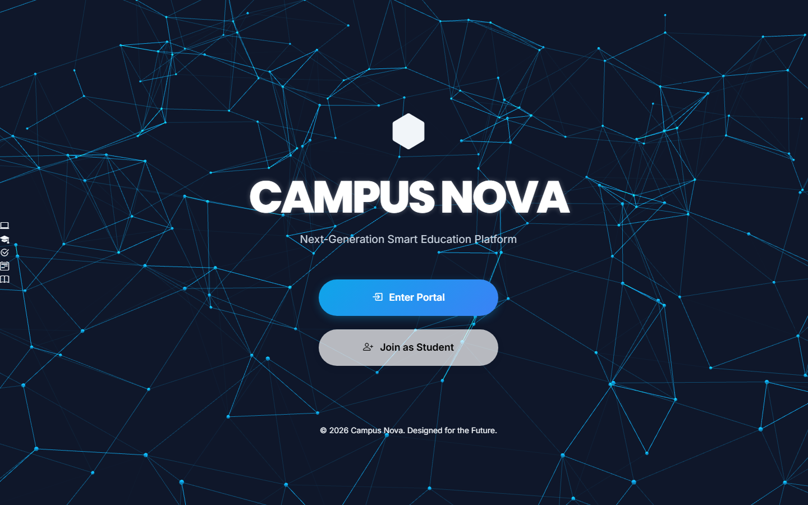
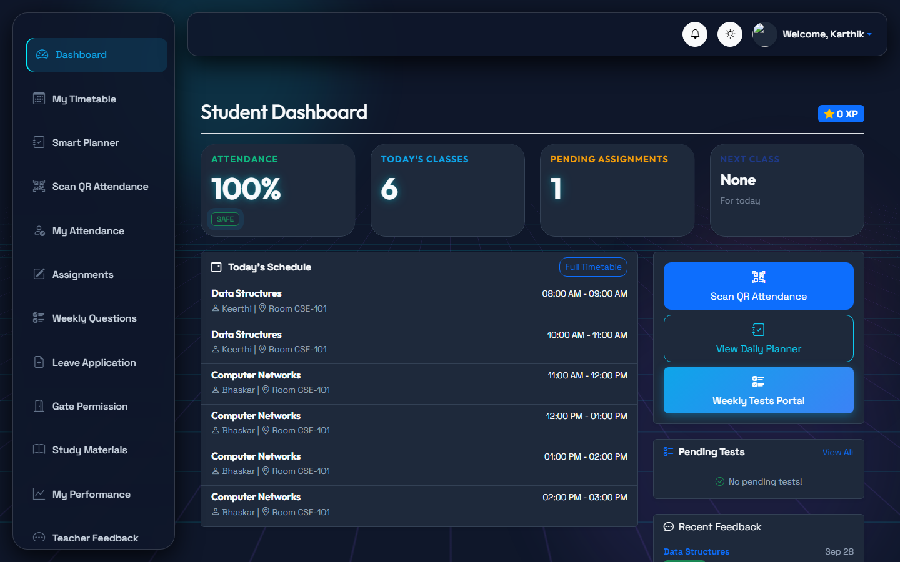
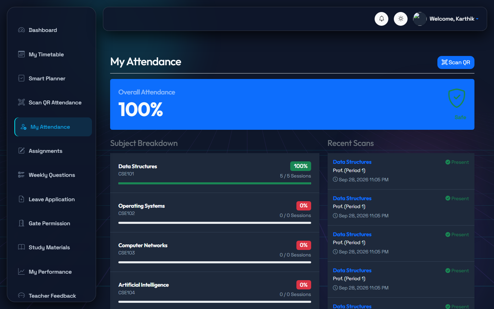
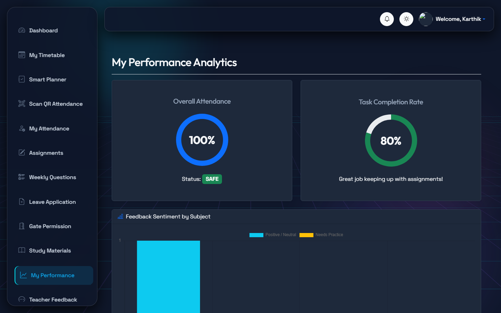
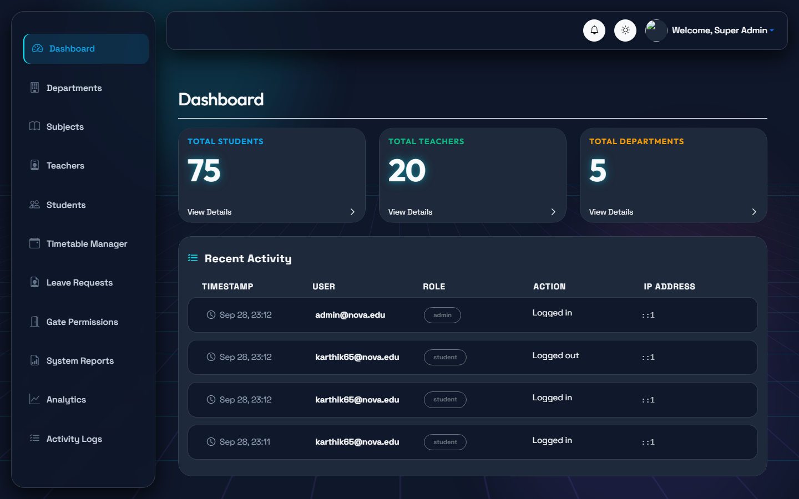
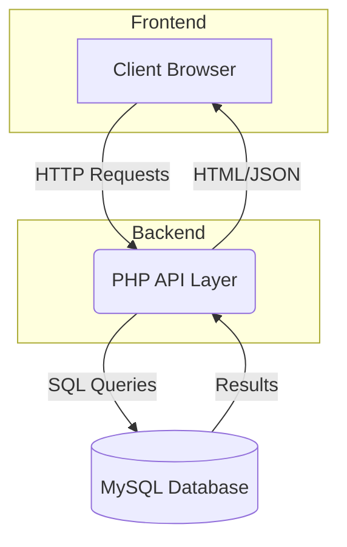
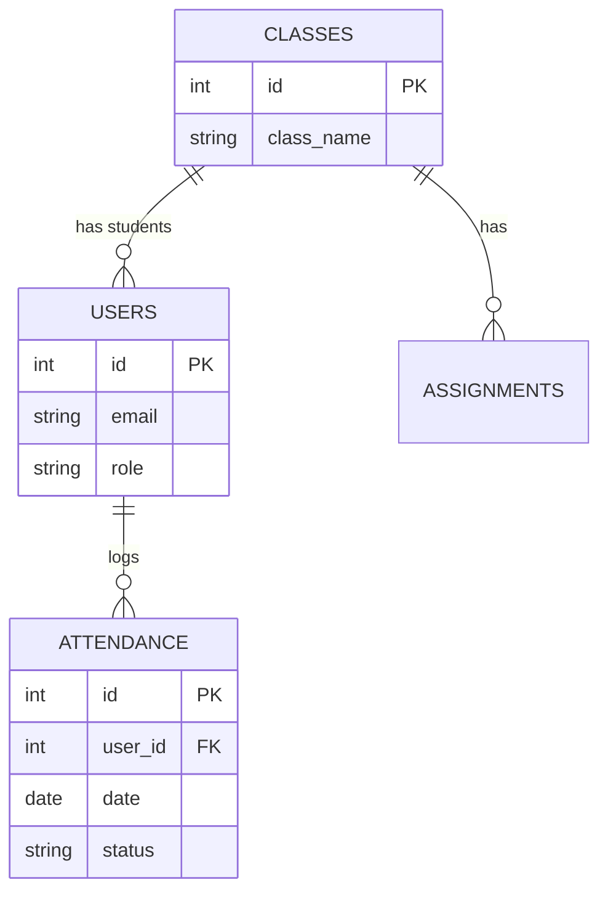

<div align="center">
  

  <h1>Campus Nova</h1>
  <p><strong>Smart Education Platform</strong></p>

  <p><em>"Ditch the paperwork. Streamline attendance, track performance, and empower your campus."</em></p>

  <p>
    
    
    
    
  </p>
</div>

---

## 📖 What is Campus Nova?

Hi there! 👋 Welcome to Campus Nova. 

I built this platform to tackle a really common headache in schools and colleges: outdated, paper-heavy management. Campus Nova is a smart education platform designed to connect students, teachers, and admins into one smooth, centralized workflow. 

Instead of passing around sign-in sheets, we use live QR codes. Instead of wondering how they're doing in class, students get a real-time dashboard. Plus, I baked in some really cool 3D visuals using Three.js and a clean glassmorphism UI to make the platform actually feel *good* to use!

---

## 🛑 The Problem We're Solving

If you've ever spent time in a traditional classroom setting, you know the struggle:
- **Wasted Time**: Teachers lose 5-10 minutes of instruction time just calling roll or passing around attendance sheets.
- **Disconnected Tools**: Assignments live in one place, grades in another, and attendance in a binder somewhere. 
- **Being in the Dark**: Students usually don't know their attendance has dropped into the "danger zone" until it's too late.
- **Admin Headaches**: Managing all this data manually is just a recipe for human error.

---

## 💡 How Campus Nova Works

I wanted to make the daily academic routine as frictionless as possible. Here's the core loop that drives the platform:

**Student Enrolls** → **Scans a Live QR Code** → **Checks Their Real-time Dashboard** → **Submits Assignments** → **Teachers Analyze the Data**

---

## 🖼️ See It In Action

*(Note: Add your actual application screenshots to `docs/screenshots/`)*

### The Student View


### Live QR Attendance


### Performance Tracking


### Admin Control Center


---

## ✨ Features I'm Proud Of

- **Immersive 3D UI**: I wanted this to feel like a modern app, not a dusty portal from 2005. So, I integrated Three.js to give the background a subtle, interactive 3D vibe.
- **Live QR Attendance**: This is the core of the app. Teachers generate a dynamic QR code on the spot, students scan it, and bam—attendance is logged in the database instantly.
- **Role-Based Dashboards**: Whether you log in as a Student, Teacher, or Admin, you get a completely customized workspace that shows exactly what you need to see.
- **Visual Analytics**: No more staring at spreadsheets. The platform turns raw data into clean charts so teachers and students know exactly where they stand.
- **Built-in Assignment & Leave Flows**: Students can submit work or request time off directly through the platform.

---

## 🏗️ Under the Hood

I built Campus Nova using a solid, traditional web stack. It's fast, reliable, and handles relational data beautifully.



**How data moves:**
1. **You** interact with the sleek HTML/CSS/JS frontend.
2. That frontend talks directly to the **PHP API Layer**.
3. PHP crunches the numbers (like checking if your attendance is below 75%).
4. Everything is securely saved and pulled from the **MySQL Database**.

---

## 🗄️ Database Design

A school system needs to be strict about its data. Here's a look at how the core tables relate to each other:



- **Users**: Handles logins and roles.
- **Classes**: Ties teachers to subjects and groups.
- **Attendance**: The heavy lifter logging every single scan.
- **Assignments**: Tracks who needs to submit what.

---

## 💻 Tech Stack

**Frontend**
- HTML5 & CSS3 (Lots of custom animations and glassmorphism!)
- JavaScript (Vanilla JS)
- Bootstrap 5
- Three.js & Vanta.js (For the 3D backgrounds)

**Backend**
- PHP (Native)

**Database**
- MySQL

---

## ⚙️ Engineering Highlights

I really focused on keeping the codebase clean and maintainable:
- **Clean Structure**: The frontend views are neatly separated into `student/`, `teacher/`, and `admin/` folders, while the heavy lifting happens in the `api/` folder.
- **Dynamic Data**: Everything you see on a dashboard is pulled fresh from the database—no hardcoded metrics.
- **Mobile First**: Since students will be scanning QR codes with their phones, I made sure the entire UI is snappy and responsive on mobile devices.
- **DRY Code**: Reusable headers, footers, and components are tucked away in `includes/` to keep the main files clean.

---

## 🔒 Security Measures

Handling student data means security can't be an afterthought:
- **Session Security**: The whole app is locked down with secure session-based authentication.
- **Hashed Passwords**: I use secure cryptographic hashing before any password touches the database.
- **Strict Routing**: If a student tries to navigate to a teacher's URL, the router kicks them out. 
- **Sanitized Inputs**: Built-in protections against SQL injection and XSS attacks.

---

## 📁 Project Structure

Here's a quick map of the repository:

```text
Campus-Nova/
├── admin/               # Admin tools (manage users, classes)
├── api/                 # Where the PHP backend magic happens
├── assets/              # CSS, JS, and Images (3D scripts live here too)
├── auth/                # Login, registration, and session management
├── config/              # DB connection strings and environment setups
├── database/            # Contains the schema_dump.sql to get you started
├── docs/                # Architecture diagrams and screenshots
├── student/             # The student portal (dashboard, attendance history)
├── teacher/             # The teacher portal (QR generator, class analytics)
├── index.php            # The landing page
└── README.md            # You are here!
```

---

## 🚀 Get It Running Locally

Want to spin this up on your own machine? It's pretty straightforward.

### What you need:
- PHP (v7.4+)
- MySQL (v5.7+)
- A local server environment like XAMPP or MAMP

### Steps:
1. **Clone it:**
```bash
git clone https://github.com/YourUsername/Campus-Nova.git
cd Campus-Nova
```

2. **Set up the Database:**
Create a MySQL database named `campus_nova`, then import the schema:
```bash
mysql -u root -p campus_nova < schema_dump.sql
```

3. **Configure the Environment:**
Copy the template file:
```bash
cp .env.example .env
```
Open up `.env` and drop in your local database credentials.

4. **Fire it up:**
You can just use PHP's built-in server for testing:
```bash
php -S localhost:8000
```
Then head over to `http://localhost:8000` in your browser.

---

## 🗺️ What's Next? (Roadmap)

I'm always looking to improve the platform. Here is what I'm currently tracking:

- [x] Secure Role-Based Authentication
- [x] Live QR Code Attendance Engine
- [x] Real-time Analytics Dashboards
- [x] 3D UI Integration
- [ ] Automated Email/SMS Alerts for low attendance
- [ ] Deeper Administrative Analytics
- [ ] Dedicated Native Mobile App
- [ ] Cloud Deployment Pipeline (CI/CD)

---

## 🌐 Live Demo

*Live demo is currently in the works—check back soon!*

---

<br />
<p align="center"><i>Built with ❤️ to make education a little bit smarter.</i></p>
