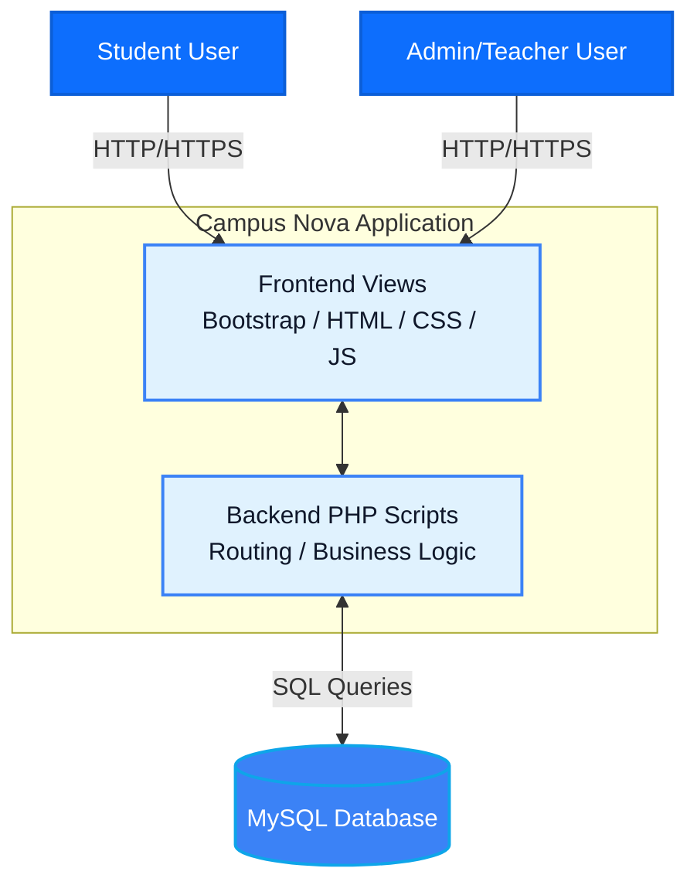

# Architecture Diagram

```mermaid
graph TD
    Student[Student User] --> |HTTP/HTTPS| Frontend[Frontend Views]
    Admin[Admin/Teacher User] --> |HTTP/HTTPS| Frontend
    
    subgraph Campus Nova Application
        Frontend[Frontend Views<br>Bootstrap / HTML / CSS / JS]
        Backend[Backend PHP Scripts<br>Routing / Business Logic]
        
        Frontend <--> Backend
    end
    
    Backend <--> |SQL Queries| DB[(MySQL Database)]
    
    classDef main fill:#0d6efd,stroke:#0b5ed7,stroke-width:2px,color:#fff;
    classDef app fill:#e0f2fe,stroke:#3b82f6,stroke-width:2px,color:#0f172a;
    classDef db fill:#3b82f6,stroke:#0ea5e9,stroke-width:2px,color:#fff;
    
    class Student,Admin main;
    class Frontend,Backend app;
    class DB db;
```
