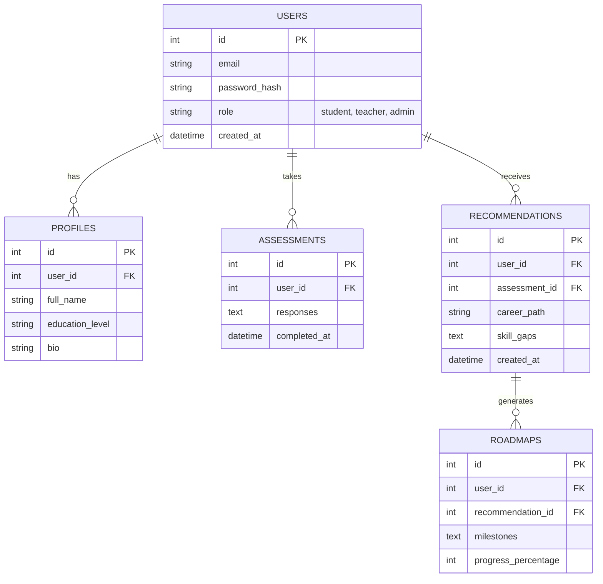

# Database Schema

```mermaid
erDiagram
    USERS ||--o{ PROFILES : has
    USERS ||--o{ ASSESSMENTS : takes
    USERS {
        int id PK
        string email
        string password_hash
        string role "student, teacher, admin"
        datetime created_at
    }
    PROFILES {
        int id PK
        int user_id FK
        string full_name
        string education_level
        string bio
    }
    ASSESSMENTS {
        int id PK
        int user_id FK
        text responses
        datetime completed_at
    }
    RECOMMENDATIONS {
        int id PK
        int user_id FK
        int assessment_id FK
        string career_path
        text skill_gaps
        datetime created_at
    }
    ROADMAPS {
        int id PK
        int user_id FK
        int recommendation_id FK
        text milestones
        int progress_percentage
    }
    
    USERS ||--o{ RECOMMENDATIONS : receives
    RECOMMENDATIONS ||--o{ ROADMAPS : generates
```
